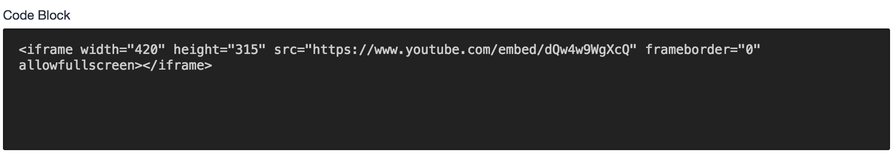

# Code Block plugin for Craft CMS

_A simple field type for code samples_

Using this plugin is incredibly easy. When creating a new field, simply select "Code Block" as your field type. Yes, it even works within a Matrix field. :)

**What the field looks like:**

When you output your field's data in a Twig template, there are two ways to do it...

To **show** the source code, use this:

    {{ entry.codeBlock }}

To **render** the source code, use this:

    {{ entry.codeBlock|raw }}
